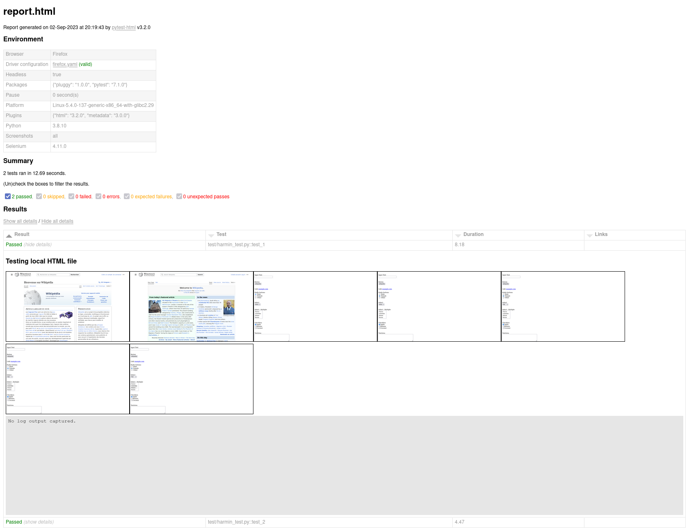
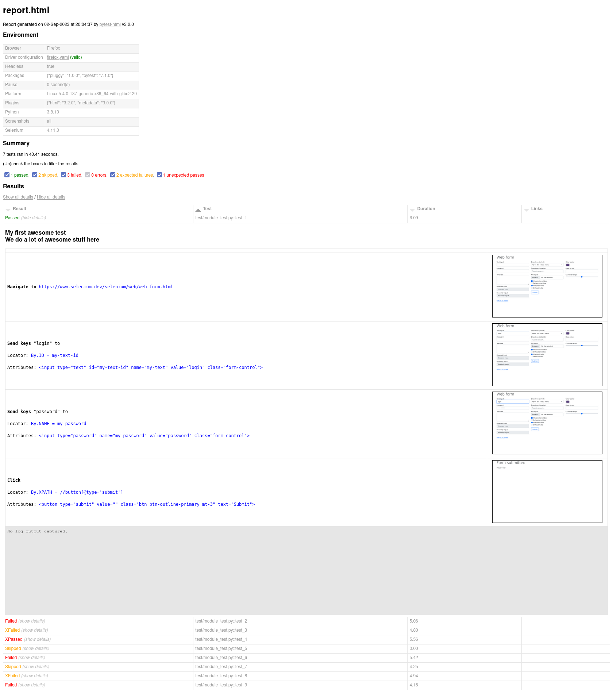

========
Features
========

The events being intercepted are:

* ``after_navigate_to``
* ``after_navigate_back``
* ``after_navigate_forward``
* ``click``
* ``after_change_value_of``

----

Docstring of tests are also included in the report, as mean to provide a long description of tests.

Therefore, you are highly encouraged to document your tests with docstrings.

=====
Usage
=====

Options
=======

Required options via command line
---------------------------------

* ``--browser``
 
The browser to use.

Accepted values: ``firefox``, ``chrome``, ``chromium``, ``edge`` or ``safari``

Optional options via command line
---------------------------------

* ``--screenshots``

The strategy of screenshot gathering.

Accepted values:

* ``all``:    Screenshot for each intercepted webdriver event.

* ``last``:   Screenshot of the last step of each test.

* ``failed``: Screenshot of the last step of each ``failed``, ``xfailed`` and ``xpassed`` test.

* ``manual``: Screenshots aren't logged automatically. They can be logged manually.

* ``none``:   Screenshots are completely disabled.

Default value: ``all``

----

* ``--headless``

Whether to run the browser in headless mode.

Default value: ``False``

----

* ``--log-attributes``

| Whether to log WebElement locators and attributes.
| Only applicable when ``--screenshots=all``.

Default value: ``False``

----

* ``--log-page-source``

Whether to log web page sources.

Default value: ``False``

----

* ``--log-verbose``

Same as combining ``--log-attributes`` and ``--log-page-source`` options.

Default value: ``False``

Optional options via pytest.ini file
------------------------------------

* **maximize_window**

Whether to maximize the browser window.

Accepted values: ``True`` or ``False``

Default value: ``False``

----

* **driver_config**

JSON or YAML file path containing the driver configuration to use.

Accepted file extensions: 

``.json`` for JSON files

``.yaml`` or ``.yml`` for YAML files.

----

* **driver_firefox**

File path of the Firefox driver to use.

Takes precedence over the driver path mentioned in the json/yaml configuration file.

----

* **driver_chrome**

File path of the Chrome driver to use.

Takes precedence over the driver path mentioned in the json/yaml configuration file.

----

* **driver_chromium**

File path of the Chromium driver to use.

Takes precedence over the driver path mentioned in the json/yaml configuration file.

----

* **driver_edge**

File path of the Edge driver to use.

Takes precedence over the driver path mentioned in the json/yaml configuration file.

----

* **driver_safari**

File path of the Safari driver to use.

Takes precedence over the driver path mentioned in the json/yaml configuration file.

----

* **description_tag**

The HTML tag for the test description (test docstring).

Accepted values: ``h1``, ``h2``, ``h3``, ``p`` or ``pre``

Default value: ``h2``

----

* **pause**

The time in seconds (as integer or float) to pause after each webdriver event.

Default value: ``0``

Screenshot gathering
====================

The screenshot gathering strategies are:

* ``all``:    Screenshot for each intercepted webdriver event.

* ``last``:   Screenshot of the last step of each test.

* ``failed``: Screenshot of the last step of each ``failed``, ``xfailed`` and ``xpassed`` test.

* ``manual``: Screenshot aren't logged automatically. They can be logged manually.

* ``none``:   Screenshots are completely disabled.

The function scoped ``webdriver`` fixture provides a method named ``log_screenshot`` that allows logging screenshots manually (``webdriver.log_screenshot(comment: str)``).

Manual logs will only appear in the HTML report when the screenshot gathering strategy is ``manual``.

In ``manual`` mode, screenshot of the last step of ``failed``, ``xfailed`` and ``xpassed`` tests are automatically logged as well.

| Screenshots are stored in the parent folder of the HTML report, provided by 
| the **pytest-html** ``--html`` command-line option.

Limitations
===========

No support for any kind of parallel tests execution (multi-treads, multi-tabs or multi-windows).

Example
=======

The plugin provides a function scoped ``webdriver`` fixture.

| **pytest-selenium-auto** needs to be executed in conjunction of **pytest-html** plugin.
| Therefore, the ``--html`` option also needs to be provided.

An external CSS file needs to be provided by using the **pytest-html** ``--css`` command-line option.

Command-line invocation
-----------------------

.. code-block:: bash

  pytest --html=/path/to/report --css=/path/to/css --browser=firefox --headless --screenshots=all --log-attributes --log-page-source

Sample ``pytest.ini`` file
--------------------------

.. code-block:: ini

  maximize_window = True
  pause = 0.5
  driver_firefox = /path/to/driver
  driver_config = /path/to/conf.yml

Sample code
-----------

* With automatic screenshot logging

.. code-block:: python

  def test_sample(webdriver):
      """
      My first awesome test
      We do a lot of awesome stuff here
      """

      webdriver.get("https://www.selenium.dev/selenium/web/web-form.html")
      webdriver.find_element(By.NAME, 'my-text').send_keys('login')
      webdriver.find_element(By.NAME, 'my-password').send_keys('password')

* With manual screenshot logging

.. code-block:: python

  def test_sample(webdriver):
      webdriver.get("https://www.selenium.dev/selenium/web/web-form.html")
      webdriver.find_element(By.NAME, 'my-text').send_keys('login')
      webdriver.find_element(By.NAME, 'my-password').send_keys('password')
      webdriver.log_screenshot("Fill in authentication form")

Sample CSS file
===============

.. code-block:: css

  .selenium_separator {
      height:5px;
      background-color: gray;
      display: none;
  }
  
  .selenium_td {
      width: 320px;
      /* text-align: center; */
  }
  
  .selenium_td_div {
      text-align: center;
  }
  
  .selenium_div {
      display: inline-block;
      text-align: center;
  }
  
  .selenium_div br + a,
  .selenium_td_div br + a {
      font-size: 12px;
      color: #999;
  }
  
  .selenium_log_comment {
      font-family: monospace;
      color: maroon;
  }
  
  .selenium_log_description {
      font-family: monospace;
      color: black;
  }
  
  .selenium_log_action {
      font-weight: bold;
      color: black;
  }
  
  .selenium_log_target {
      color: blue;
  }
  
  .selenium_log_quotation {
      font-family: monospace;
      font-weight: bold;
      color: black;
  }
  
  .selenium_log_fatal {
      font-family: monospace;
      color: red;
  }
  
  .selenium_log_img {
      border: 1px solid black;
      width: 300px;
      height: 170px;
      object-fit: cover;
      object-position: top;
  }

Sample YAML configuration files
===============================

* Simple YAML configuration:

.. code-block:: yaml

  capabilities:
      acceptInsecureCerts: true
      proxy:
          proxyType: manual
          httpProxy: localhost:8080
          sslProxy: localhost:8080
  window:
      headless: false
      maximize: false
      position:
          x: 10
          y: 10
      size:
          width: 600
          height: 600
  browsers:
      firefox:
          options:
              binary_location: /path/to/browser
          service:
              driver_path: /path/to/driver
              log_output: /path/to/log
      chrome:
          options:
              binary_location: /path/to/browser
          service:
              driver_path: /path/to/driver
              log_output: /path/to/log
      chromium:
          options:
              binary_location: /path/to/browser
          service:
              driver_path: /path/to/driver
              log_output: /path/to/log
      edge:
          options:
              binary_location: /path/to/browser
          service:
              driver_path: /path/to/driver
              log_output: /path/to/log

* Complete YAML configuration:

.. code-block:: yaml

  capabilities:
      acceptInsecureCerts: true
      pageLoadStrategy: normal, eager or none
      timeouts:
          script: 30000
          pageLoad: 300000
          implicit: 0
      proxy:
          proxyType: pac, direct, autodetect, system or manual
          proxyAutoconfigUrl: url
          httpProxy: localhost:3128
          noProxy: localhost
          sslProxy: localhost:3128
          socksProxy: localhost:3128
          socksVersion: 0
  window:
      headless: false
      maximize: true
      position:
          x: 10
          y: 10
      rect:
          x: 10
          y: 10
          width: 200
          height: 200
      size:
          width: 200
          height: 200
  browsers:
      firefox:
          options:
              binary_location: /path/to/browser
              arguments:
                 -  arg1
                 -  arg2
              preferences:
                  pref1: value1
                  pref2: value2
          addons:
             -  /path/to/addon1
             -  /path/to/addon2
          profile:
              directory: /path/to/profile/directory or empty for null value
              preferences:
                  pref1: value1
                  pref2: value2
              extensions:
                 -  /path/to/extension1
                 -  /path/to/extension2
          service:
              driver_path: /path/to/driver
              log_output: /path/to/log
              port: 0
              args:
                 -  arg1
                 -  arg2
      chrome:
          options:
              binary_location: /path/to/browser
              arguments:
                 -  arg1
                 -  arg2
              extensions:
                 -  /path/to/extension1
                 -  /path/to/extension2
          service:
              driver_path: /path/to/driver
              log_output: /path/to/log
              port: 0
              args:
                 -  arg1
                 -  arg2
      edge:
          options:
              binary_location: /path/to/browser
              arguments:
                 -  arg1
                 -  arg2
              extensions:
                 -  /path/to/extension1
                 -  /path/to/extension2
          service:
              driver_path: /path/to/driver
              log_output: /path/to/log
              port: 0
              args:
                 -  arg1
                 -  arg2

Sample JSON configuration files
===============================

* Simple JSON configuration:

.. code-block:: json

  {
      "capabilities": {
          "acceptInsecureCerts": true,
          "proxy": {
              "proxyType": "manual",
              "httpProxy": "localhost:8080",
              "sslProxy" : "localhost:8080"
          }
      },    
      "window": {
          "headless": false,
          "maximize": false,
          "position": {
              "x": 10,
              "y": 10
          },
          "size": {
            "width": 600,
            "height": 600
          }
      },
      "browsers": {    
          "firefox": {
              "options": {
                  "binary_location": "/path/to/browser"
              },
              "service":{
                  "driver_path": "/path/to/driver",
                  "log_output": "/path/to/log"
              }
          },
          "chrome": {
              "options": {
                  "binary_location": "/path/to/browser"
              },
              "service": {
                  "driver_path": "/path/to/driver",
                  "log_output": "/path/to/log"
              }  
          },
          "chromium": {
              "options": {
                  "binary_location": "/path/to/browser"
              },
              "service": {
                  "driver_path": "/path/to/driver",
                  "log_output": "/path/to/log"
              }
          },
          "edge": {
              "options": {
                  "binary_location": "/path/to/browser"
              },
              "service": {
                  "driver_path": "/path/to/driver",
                  "log_output": "/path/to/log"
              }
          }
      }
  }

* Complete JSON configuration:

.. code-block:: json

  {
      "capabilities": {
          "acceptInsecureCerts": true,
          "pageLoadStrategy": "normal, eager or none",
          "timeouts": {
              "script": 30000,
              "pageLoad": 300000,
              "implicit": 0
          },
          "proxy": {
              "proxyType": "pac, direct, autodetect, system or manual",
              "proxyAutoconfigUrl": "url",
              "httpProxy": "localhost:3128",
              "noProxy": "localhost",
              "sslProxy": "localhost:3128",
              "socksProxy": "localhost:3128",
              "socksVersion": 0
          }
      },
      "window": {
          "headless": false,
          "maximize": true,
          "position": {
              "x": 10,
              "y": 10
          },
          "rect": {
              "x": 10,
              "y": 10,
              "width": 200,
              "height": 200
          },
          "size": {
              "width": 200,
              "height": 200
          }
      },    
      "browsers": {
          "firefox": {
              "options": {
                  "binary_location": "/path/to/browser",
                  "arguments": [
                      "arg1",
                      "arg2"
                  ],
                  "preferences": {
                      "pref1": "value1",
                      "pref2": "value2"
                  }
              },
              "addons": [
                "/path/to/addon1",
                "/path/to/addon2"
              ],
              "profile":{
                  "directory": "/path/to/profile/directory or null",
                  "preferences": {
                      "pref1": "value1",
                      "pref2": "value2"
                  },
                  "extensions": [
                      "/path/to/extension1",
                      "/path/to/extension2"
                  ]
              },
              "service":{
                  "driver_path": "/path/to/driver",
                  "log_output": "/path/to/log",
                  "port": 0,
                  "args": [
                      "arg1",
                      "arg2"
                  ]
              }
          },
          "chrome": {
              "options": {
                  "binary_location": "/path/to/browser",
                  "arguments": [
                      "arg1",
                      "arg2"
                  ],
                  "extensions": [
                      "/path/to/extension1",
                      "/path/to/extension2"
                  ]
              },
              "service": {
                  "driver_path": "/path/to/driver",
                  "log_output": "/path/to/log",
                  "port": 0,
                  "args": [
                      "arg1",
                      "arg2"
                  ]
              }
          },
          "edge": {
              "options": {
                  "binary_location": "/path/to/browser",
                  "arguments": [
                      "arg1",
                      "arg2"
                  ],
                  "extensions": [
                      "/path/to/extension1",
                      "/path/to/extension2"
                  ]
              },
              "service": {
                  "driver_path": "/path/to/driver",
                  "log_output": "/path/to/log",
                  "port": 0,
                  "args": [
                      "arg1",
                      "arg2"
                  ]
              }
          }
      }
  }

Sample reports
==============

----

